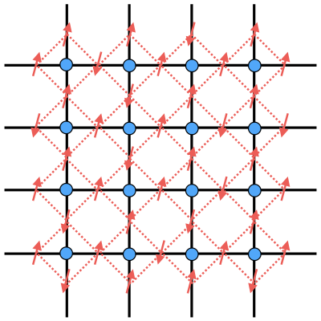

# Example: Classical Potts model

## Partition Function Tensor

Consider the classical $q$-Potts model on the square lattice ($q \ge 2$ is a positive integer). The partition function at temperature $T = 1 / \beta$ is

$$
\begin{equation}
    Z(\beta) = \sum_s e^{-\beta H(s)},
    \quad
    H(s) = -\sum_{\langle ij \rangle} \delta_{s_i s_j}
\end{equation}
$$

where $s = \{s_1, s_2, ...\}$, and $s_i \in \{1, ..., q\}$ is the spin at site $i$ of the lattice. The summation over all the spins can be interpreted as the contraction in the following tensor network

Elements of the tensor (map) $T: V \otimes V \leftarrow V \otimes V$ ($\dim V = q$) are

$$
\begin{equation}
    T_{w s; n e} = \exp[\beta(
        \delta_{ws} + \delta_{se} + \delta_{en} + \delta_{nw}
    )]
\end{equation}
$$

The indices $w,s,n,e \in \{1,...,q\}$ refer to the west, south, north and east indices, respectively. 

## Symmetric Group Symmetry

$T$ is invariant under the transformation

$$
\begin{equation}
    \forall g \in S_q: \quad
    T = [\rho(g) \otimes \rho(g)] T
    [\rho^\dagger(g) \otimes \rho^\dagger(g)]
\end{equation}
$$

where $\rho: S_q \to \mathrm{End}(V)$ is the (unitary) *permutation representation* of the symmetric group $S_q$. In this representation, each element of $S_q$ is represented by the corresponding $q$-dimensional permutation matrix. Here we use the convention that each permutation matrix is obtained by permuting *columns* of the identity matrix. For example, the cyclic permutation $(1 \ 2 \ 3)$ (when $q = 3$) is represented by

$$
\begin{equation}
    \rho_{(1 \ 2 \ 3)} = \begin{bmatrix}
        0 & 0 & 1 \\
        1 & 0 & 0 \\
        0 & 1 & 0 \\
    \end{bmatrix}
\end{equation}
$$

In order to reveal the graded structure of the space $V$ (and therefore the block structure of $T$), we need to transform to the basis of the irreducible representations. In general, the permutation representation of $S_q$ can be reduced to the direct sum of the *trivial representation* $[q]$ (1-dimensional) and the *standard representation* $[q-1, 1]$ ($(q - 1)$-dimensional), without multiplicity:

$$
\begin{equation}
    [\rho] = [q] \oplus [q-1, 1]
\end{equation}
$$

For each irrep $\rho_l$ appearing on the right side, we can find the corresponding *intertwiner* (equivariant map) $f_l: V \leftarrow V_l$ ($V_l$ is the vector space realizing the irrep $\rho_l$) satisfying

$$
\begin{equation}
    \forall g \in S_q: \quad 
    \rho(g) f_l = f_l \rho_l(g), \quad
    f^\dagger_l f_l = 1_{V_l}
\end{equation}
$$

$f_l$ can be expressed as a $q \times \dim(\rho_l)$ matrix. From the left-unitary condition, we further obtain

$$
\begin{equation}
    \rho_l(g) = f^\dagger_l \rho(g) f_l
\end{equation}
$$

Let $f$ be the $q \times q$ unitary matrix obtained by joining the columns of all intertwiners together. Then

$$
\begin{equation}
    \rho(g) = f \tilde{\rho}(g) f^\dagger,
    \quad \tilde{\rho}(g) = \bigoplus_{i} \rho_l(g)
\end{equation}
$$

The symmetry of $T$ under $S_q$ can be expressed as

$$
\begin{align*}
    T &= [
        f \tilde{\rho}(g) f^\dagger \otimes 
        f \tilde{\rho}(g) f^\dagger
    ] T [
        f \tilde{\rho}^\dagger(g) f^\dagger \otimes 
        f \tilde{\rho}^\dagger(g) f^\dagger
    ]
    \\
    &= (f \otimes f)
    [\tilde{\rho}(g) \otimes \tilde{\rho}(g)]
    (f^\dagger \otimes f^\dagger) T
    (f \otimes f)
    [\tilde{\rho}^\dagger(g) \otimes \tilde{\rho}^\dagger(g)]
    (f^\dagger \otimes f^\dagger)
\end{align*}
$$

We then redefine the partition function tensor as

$$
\begin{equation}
    \tilde{T} = (f^\dagger \otimes f^\dagger) T (f \otimes f)
\end{equation}
$$

which is directly invariant under the reduced permutation representation $\tilde{\rho}$ under the irrep basis:

$$
\begin{equation}
    \forall g \in S_q: \quad
    \tilde{T} = [\tilde{\rho}(g) \otimes \tilde{\rho}(g)] 
    \tilde{T}
    [\tilde{\rho}^\dagger(g) \otimes \tilde{\rho}^\dagger(g)]
\end{equation}
$$

From now on we drop the tilde on $\tilde{\rho}$ and $\tilde{T}$ under the irrep basis.

## Reduced tensor elements

!!!info
    
    For more details, please refer to [*A symmetric tensor deep dive*](https://quantumkithub.github.io/TensorKit.jl/v0.16/appendix/symmetric_tutorial/) in TensorKit documentation.

Let us denote the irrep basis vectors as $\ket{l,m}$, where $l$ labels the irreps, and $m$ labels the basis vectors of the $l$-th irrep. The elements of $T$ are written as

$$
\begin{equation}
    \braket{(l_1, m_1)(l_2, m_2) | T | (l_3, m_3) (l_4, m_4)}
\end{equation}
$$

We can fuse $V \otimes V$ and decompose it under the basis of irreps. For example, when $q = 5$, where $l_1, ..., l_4 = [5_1], [4_1 1_1]$, the relevant fusion rules are

$$
\begin{equation}
\begin{aligned}
    [5_1] \times [5_1] &= [5_1]
    \\
    [5_1] \times [4_1 1_1]
    &= [4_1 1_1] \times [5_1]
    = [4_1 1_1]
    \\
    [4_1 1_1] \times [4_1 1_1]
    &= [5_1] +  [4_1 1_1] + [3_1 2_1] + [3_1 1_2]
\end{aligned}
\end{equation}
$$

The basis transformation is unitary, and can be written as

$$
\begin{equation}
    \bra{(l_1, m_1) (l_2, m_2)}
    = \sum_{k_{l_1 l_2}} \sum_{n^k_{l_1 l_2}}
    \braket{(l_1, m_1) (l_2, m_2) | (k_{l_1 l_2}, n^k_{l_1 l_2})} \bra{(k_{l_1 l_2}, n^k_{l_1 l_2})}
\end{equation}
$$

Here $k_{l_1 l_2}$ enumerates irreps resulting from $l_1 \otimes l_2$, and $n^k_{l_1 l_2}$ enumerates the basis vectors of the irrep $k_{l_1 l_2}$. The coefficients

$$
\begin{equation}
    (C^k_{l_1 l_2})^n_{m_1 m_2}
    = \braket{(l_1,m_1) (l_2,m_2) | (k, n)}
\end{equation}
$$

are called the *Clebsch-Gordan (CG) coefficients*. All CG coefficients for a fixed triplet $(l_1, l_2, k)$ of irreps form the *fusion tensor*, which can be accessed by `fusiontensor(l₁, l₂, k)`.

!!!note

    In this particular case, each irrep $k \in l_1 \otimes l_2$ only appear once in the decomposition. Then the fusion tensor $C^k_{l_1 l_2}$ has dimensions $\dim l_1 \times \dim l_2 \times \dim k \times 1$.

With this basis transformation, we can write elements of $T$ as

$$
\begin{align*}
    &\braket{(l_1, m_1)(l_2, m_2) | T | (l_3, m_3) (l_4, m_4)}
    \\
    &= \sum_{k_{l_1 l_2}} \sum_{k_{l_3 l_4}}
    \sum_{n^k_{l_1 l_2}} \sum_{n^k_{l_3 l_4}}
    \braket{(l_1, m_1)(l_2, m_2) | (k_{l_1 l_2}, n^k_{l_1 l_2})}
    \\ &\qquad
    \braket{(k_{l_1 l_2}, n^k_{l_1 l_2}) | T | (k_{l_3 l_4}, n^k_{l_3 l_4})}
    \braket{(k_{l_3 l_4}, n^k_{l_3 l_4}) | (l_3, m_3) (l_4, m_4)}
\end{align*}
$$

Because of the symmetry of $T$ under the action of $S_q$, according to the Schur lemma, 

$$
\begin{equation}
    \braket{(k_{l_1, l_2}, n^k_{l_1 l_2}) | T | (k_{l_3 l_4}, n^k_{l_3 l_4})}
    = (T_k)^{l_3 l_4}_{l_1 l_2} \delta_{k_{l_1 l_2} k_{l_3 l_4}} \delta_{n_{out} n_{in}}
\end{equation}
$$

Here $\{(T_k)^{l_3 l_4}_{l_1 l_2}\}$ are called the *reduced tensor elements* of $T$. They only depend on the input irreps $(l_3, l_4)$, fused irrep $k$, and the output irreps $(l_1, l_2)$. These related irreps are collectedly referred to as the *fusion tree*.

Note that reduced elements with the same $k$ but different input/output irreps are in general different. 

To extract the reduced element $(T_k)^{l_3 l_4}_{l_1 l_2}$, we can perform the inverse basis transformation:

$$
\begin{align}
    & (T_k)^{l_3 l_4}_{l_1 l_2} \delta_{n_1 n_2}
    =\braket{(k,n_1) | T | (k,n_2)}
    \nonumber \\
    &= \sum_{m_1,m_2} \sum_{m_3,m_4}
    \braket{(k,n_1)|(l_1,m_1)(l_2,m_2)}
    \nonumber \\ &\qquad
    \braket{(l_1,m_1)(l_2,m_2)|T|(l_3,m_3)(l_4,m_4)}
    \braket{(l_3,m_3)(l_4,m_4)|(k,n_2)}
\end{align}
$$
